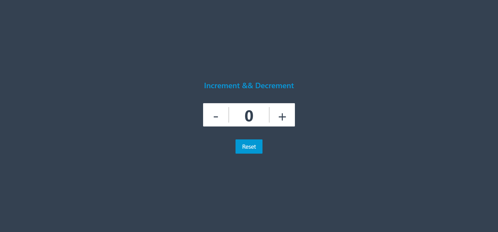

# React-CounterApp

A simple counter application built with React to demonstrate the use of the `useState` hook. This project serves as a basic example of state management in React.

## Features

- Increment and decrement the counter value
- Reset the counter to the initial value
- Real-time counter updates using React's `useState` hook

## Learning Objectives

Through this project, I learned:

- How to use the `useState` hook to manage state in functional components.
- The basics of creating and updating state in a React application.
- Handling events in React to trigger state changes.

## Usage

Once the app is running, you can:

- Click the "Increment" button to increase the counter.
- Click the "Decrement" button to decrease the counter.
- Click the "Reset" button to reset the counter to its initial value.

## Screenshot

---

Thank you for checking out this project! 😊