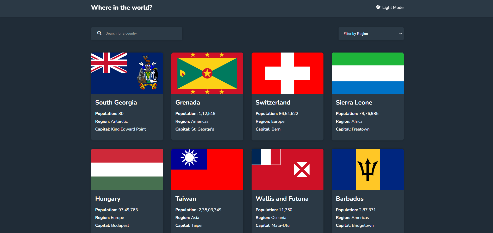

# Countries App

This React application allows users to search for countries and filter them by region using data fetched from the REST Countries API. It features a search bar for keyword-based search and a dropdown menu to filter countries by their respective regions. The app also supports a dark theme, which can be toggled by the user.

## Features

- Search for countries by name.
- Filter countries by region (Africa, Americas, Asia, Europe, Oceania).
- Display detailed information such as country name, flag, population, region, and capital.
- Dark and light theme support.
- Fetches real-time data from the [REST Countries API](https://restcountries.com).

## Components

### 1. **Home**
   - The main component that includes the search bar, region filter, and list of countries.
   - Manages the query state and handles the dark theme by using the `useTheme` hook.

### 2. **SearchBar**
   - A search bar component that captures user input to search for countries by name.
   - It updates the search query dynamically as the user types.

### 3. **SelectMenu**
   - A dropdown filter component that allows the user to filter countries by region.
   - It updates the query based on the selected region.

### 4. **CountriesList**
   - Displays a list of countries filtered by the search query or region.
   - Fetches the countries' data from the REST Countries API and renders country cards with relevant details like flag, name, population, region, and capital.
   - Implements a shimmer effect while data is being fetched.

### 5. **CountryCard**
   - A reusable component that displays individual country information such as name, flag, population, region, and capital.

## API Used

This app uses the [REST Countries API](https://restcountries.com/v3.1/all) to fetch the data of all countries.

## Screenshot

## Technologies Used

- **React**: JavaScript library for building user interfaces.
- **REST Countries API**: Provides country data such as name, population, region, and capital.
- **CSS**: For styling the components.
- **Vite**: For fast development and build process.

## How It Works

1. **Search Bar**: Users can search for countries by typing in the search bar. The search query is managed via the `useState` hook and passed to the `CountriesList` component.
2. **Region Filter**: The `SelectMenu` component allows filtering by continent/region, updating the query state dynamically.
3. **Fetching Data**: The `CountriesList` component fetches data from the REST Countries API and filters it based on the search query or region filter.
4. **Rendering Data**: The filtered countries are displayed as a list of `CountryCard` components, each containing details about the country.
5. **Loading State**: A shimmer effect is displayed while the data is being fetched.

Thank you for exploring the Countries App! 🌍