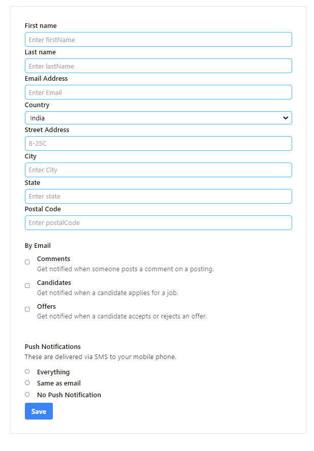

# React-FormApp

A React application for handling user inputs through a form. This project demonstrates various React concepts such as state management with hooks, controlled components, form handling, and event handling.

## Features

- A form to collect user information including name, email, address, and preferences.
- Real-time state updates as the user types into the form.
- Supports different input types: text, email, select dropdown, checkboxes, and radio buttons.
- Handles form submission to log collected data.

## React Concepts Used

### 1. **useState Hook**
   - The `useState` hook is used to manage the state of form inputs. It initializes the state with an object representing all form fields and updates the state as the user inputs data. This allows the form to be dynamic and responsive to user actions.

### 2. **Controlled Components**
   - All form inputs (text fields, checkboxes, radio buttons, and select dropdowns) are controlled components. Their values are tied to the state managed by `useState`. This ensures that React has full control over form data, which makes the form more predictable and easier to debug.

### 3. **Event Handling**
   - Event handlers such as `onChange` and `onSubmit` are used to manage user interactions with the form. The `changeHandler` function updates the state based on user input, and the `submitHandler` function prevents the default form submission and logs the form data to the console.

### 4. **Form Handling**
   - The form is structured to handle various input types, including text fields for names and email, a dropdown for selecting the country, checkboxes for options like receiving comments or job offers, and radio buttons for push notification preferences. Each input type is managed with appropriate event handling.

## Usage

- Users can fill out their personal information, choose their preferences for notifications, and submit the form.
- The application captures the user data and displays it in the console for further processing or integration with a backend service.

## Screenshot

---

Thank you for using the React-FormApp! 😊