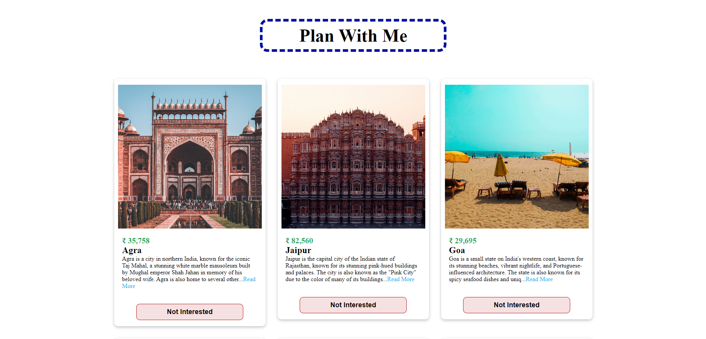

# React-PlanWithMe

A simple React application that displays a list of tours and allows users to remove a tour from the list. This project highlights essential React concepts like state management with the `useState` hook, lifting state up, and passing props to child components.

## Features

- Display a list of tours
- Remove a tour from the list
- Refresh the list to restore all tours

## React Concepts Used

### 1. **useState Hook**
   - The `useState` hook is used to manage the state of the tours list. The state is initialized with data imported from an external file and can be updated to remove or restore tours.

### 2. **Lifting State Up**
   - The `removeTour` function is defined in the `App` component, which manages the state of the tours. This function is passed down to the `Tours` component as a prop, allowing the child component to modify the parent component's state—this is known as lifting state up.

### 3. **Props**
   - The `Tours` component receives the list of tours and the `removeTour` function as props from the `App` component, enabling child components to interact with the parent component's state.

### 4. **Conditional Rendering**
   - The app conditionally renders content based on the length of the tours list. If there are no tours left, a message is displayed along with a "Refresh" button to restore the list.

## Usage

- Browse the list of available tours.
- Remove a tour by clicking the "Remove" button associated with it.
- Restore the entire list of tours by clicking the "Refresh" button when no tours are left.

## Screenshot

---

Thank you for exploring the React-PlanWithMe project! 😊