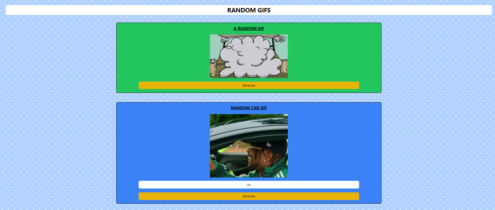

# React-GiphyApp

A React application that fetches and displays random GIFs using the Giphy API. This project demonstrates various React concepts such as state management with hooks, custom hooks, conditional rendering, and API integration with Axios.

## Features

- Fetch and display a random GIF.
- Fetch and display a GIF based on a user-defined tag.
- Reusable components and custom hooks for API integration.
- Loading spinner to indicate data fetching.

## React Concepts Used

### 1. **useState Hook**
   - The `useState` hook is used to manage state for GIF URLs, loading status, and the user-defined tag. This allows the components to maintain and update their own state dynamically based on user interaction and API responses.

### 2. **useEffect Hook**
   - The `useEffect` hook is utilized within a custom hook (`useGif`) to fetch data from the Giphy API whenever the component mounts or the tag changes. This demonstrates side effects in functional components.

### 3. **Custom Hooks**
   - A custom hook, `useGif`, is created to encapsulate the logic for fetching GIFs from the Giphy API. This promotes code reusability and separates the data-fetching logic from the presentation logic, making the code more modular and maintainable.

### 4. **Conditional Rendering**
   - Conditional rendering is used to display a loading spinner while data is being fetched. Once the data is fetched, the GIF is displayed. This enhances the user experience by providing feedback during asynchronous operations.

### 5. **Environment Variables**
   - The API key for accessing the Giphy API is stored in an environment variable (`REACT_APP_GIPHY_API_KEY`), demonstrating the use of environment variables to manage sensitive information securely.

### 6. **Event Handling**
   - Event handlers are used to manage user interactions, such as updating the tag input and fetching new GIFs on button clicks. This illustrates how React manages events and updates state accordingly.

## Usage

- The application displays a random GIF when it loads.
- Users can enter a tag to fetch a GIF related to that specific tag.
- A button is provided to fetch a new random or tagged GIF.

## Screenshot

---

Thank you for checking out the React-GiphyApp project! 😊