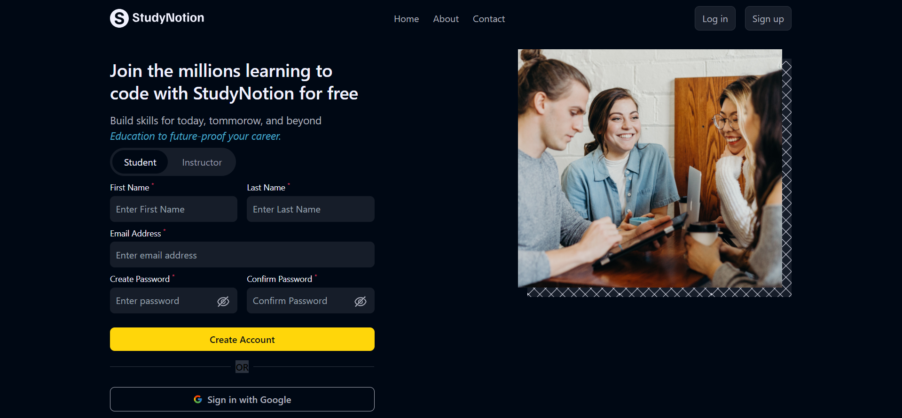

# React-RouterApp

A React application demonstrating the use of `react-router-dom` to handle different routes. This project serves as a basic example of setting up multiple routes and navigation in a React application.

## Features

- Navigation between different pages using `react-router-dom`.
- Different paths for Home, Login, Signup, and Dashboard.
- Demonstrates the use of protected routes.

## React Concepts Used

### 1. **React Router**
   - The application utilizes `react-router-dom` to create client-side routing. This allows for seamless navigation between different pages (Home, Login, Signup, and Dashboard) without refreshing the page.

### 2. **Routes and Route Components**
   - The `Routes` and `Route` components from `react-router-dom` are used to define the various routes in the application. Each route corresponds to a different component, enabling a multi-page experience in a single-page application.

### 3. **Props**
   - Props are used to pass data between components, such as passing the `isLoggedIn` state and the `setIsLoggedIn` function to the `Navbar` and `PrivateRoute` components to control navigation.

### 4. **Conditional Rendering with Private Routes**
   - The `PrivateRoute` component demonstrates how to protect routes using conditional rendering. While the actual login functionality is not implemented, this component serves as an example of how to restrict access to certain parts of an application based on user authentication status.

### 5. **Component Composition**
   - The app is composed of multiple reusable components (`Navbar`, `PrivateRoute`) and pages (`Home`, `Login`, `Signup`, `Dashboard`). This modular structure helps in managing code efficiently.

## Usage

- The app allows navigation between different pages: Home, Login, Signup, and Dashboard.
- Protected routes are set up to illustrate how access to certain routes can be restricted (though no actual authentication is implemented in this example).

## Screenshot

Thank you for checking out the React-RouterApp project! 😊