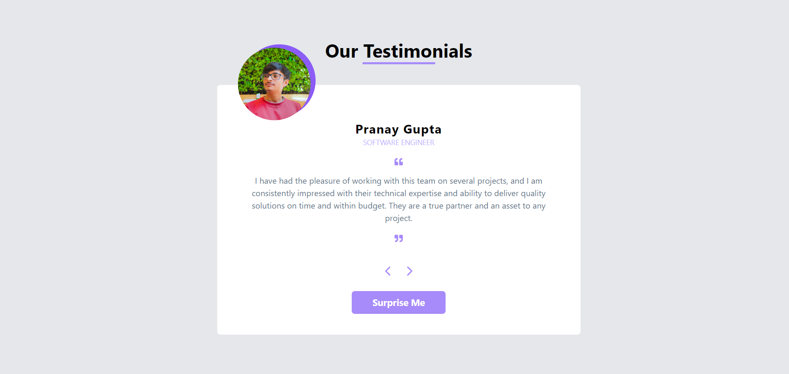

# React-TestimonialsApp

A React application that displays a list of testimonials using reusable components. This project demonstrates key React concepts such as component composition and the use of props for data handling.

## Features

- Display a list of customer testimonials
- Dynamic rendering of testimonial data
- Simple, responsive UI layout

## React Concepts Used

### 1. **Component Composition**
   - The application is built using multiple reusable components. The `App` component renders the main layout and uses the `Testimonial` component to display the testimonials. This modular approach keeps the code organized and easier to manage.

### 2. **Props**
   - Props are used to pass data between components. The `Testimonial` component receives the `reviews` data as props from the `App` component. This demonstrates how data can be passed from a parent component to a child component for rendering.

## Usage

- The application displays a title and a list of testimonials fetched from a local data file.
- Users can view all the available testimonials on the page.

## Screenshot

Thank you for exploring the React-TestimonialsApp project! 😊