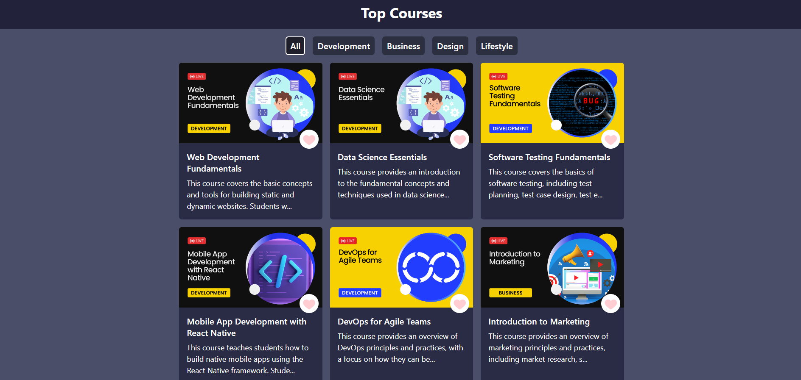

# React-CourseApp

A React application that fetches and displays a list of courses, allowing users to filter courses by category. This project demonstrates various React concepts such as state management, effect hooks, conditional rendering, and component composition.

## Features

- Fetch and display a list of courses from an API
- Filter courses by category
- Loading spinner while fetching data
- Error handling with notifications

## React Concepts Used

### 1. **useState Hook**
   - The `useState` hook is used to manage the state of courses, loading status, and the selected category. It allows for interactive UI components that respond to user input.

### 2. **useEffect Hook**
   - The `useEffect` hook is utilized to fetch data from an API when the component mounts. This side effect ensures that data is loaded from the API without blocking the rendering process.

### 3. **Props**
   - Props are used extensively to pass data and functions between components. For example, the `Filter` component receives the `filterData`, `category`, and `setCategory` as props to enable dynamic filtering of courses.

### 4. **Conditional Rendering**
   - Conditional rendering is used to display a loading spinner while data is being fetched. Once the data is loaded, the courses are displayed using the `Cards` component.

### 5. **Component Composition**
   - The application is built using multiple reusable components (`Navbar`, `Filter`, `Cards`, `Spinner`), making the code modular and easier to maintain.

### 6. **Error Handling**
   - Error handling is implemented using the `toast` library to show error messages when the data fetch fails.

## Usage

- The application initially displays a loading spinner while fetching course data.
- Once the data is fetched, users can view the list of available courses.
- Users can filter courses by selecting different categories from the filter menu.
- If an error occurs while fetching data, a notification is displayed.

## Screenshot

Thank you for checking out the React-CourseApp project! 😊