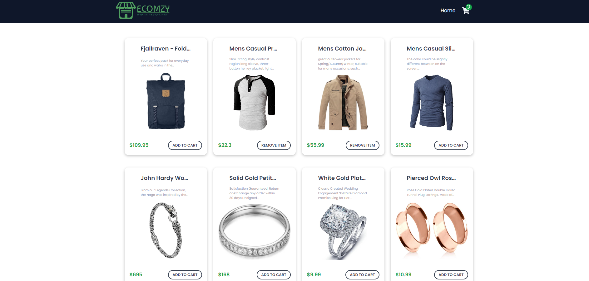
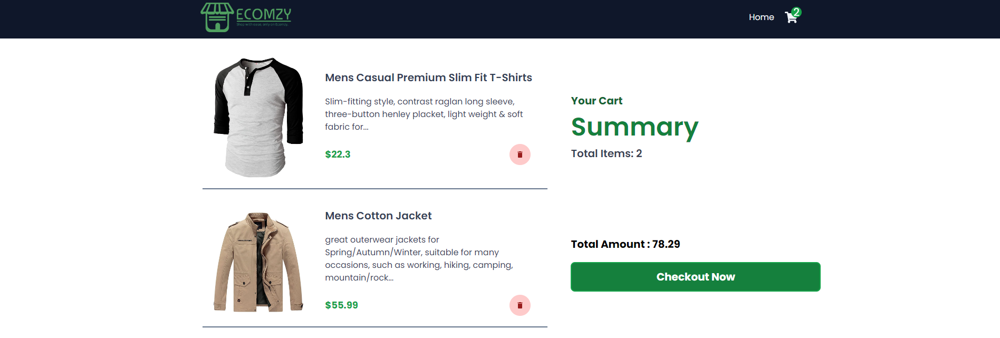

# ShoppingCart App

A React-based shopping cart application that fetches product data from a fake store API and allows users to add products to their cart. The project demonstrates the use of various React concepts such as state management, routing, conditional rendering, and integration with Redux for state management.

## Features

- Fetch and display a list of products from an external API.
- Add and remove products from the shopping cart.
- View cart summary with total items and total amount.
- Simple and responsive user interface.

## React Concepts Used

### 1. **React Router**
   - The application uses `react-router-dom` to manage client-side routing. This allows navigation between different pages (Home and Cart) without refreshing the page. The `Routes` and `Route` components are used to define the paths for the Home and Cart pages.

### 2. **useState Hook**
   - The `useState` hook is used to manage state within the components. It is used in the `Home` component to handle the loading state and the fetched product data, and in the `Cart` component to manage the total amount of items in the cart.

### 3. **useEffect Hook**
   - The `useEffect` hook is utilized to fetch product data from an external API when the `Home` component mounts and to calculate the total amount whenever the cart is updated in the `Cart` component. This demonstrates handling side effects in functional components.

### 4. **Redux State Management**
   - The application uses `react-redux` for global state management. The `useSelector` hook is used to access the cart state from the Redux store, allowing components to read data without passing props explicitly down the component tree.

### 5. **Conditional Rendering**
   - Conditional rendering is used extensively throughout the app to display different UI elements based on the state. For example, a loading spinner is displayed while the products are being fetched, and the cart displays different content depending on whether it has items or is empty.

### 6. **API Integration**
   - The `Home` component fetches product data from a fake store API using the Fetch API. This demonstrates how to integrate external data sources into a React application.

### 7. **Reusable Components**
   - Components like `Navbar`, `Product`, `CartItem`, and `Spinner` are used to create a modular and reusable UI. This promotes better code organization and reusability.

## Usage

- Home Page: Displays a list of products fetched from the API. Users can browse products.
- Cart Page: Displays the products added to the cart, along with a summary of total items and the total amount. Users can proceed to  checkout or return to the home page to shop more.

## Screenshots

Thank you for exploring the React-ShoppingCartApp project! 😊